<div align="center">

# PhDBench 🎓

**A personal PhD application tracker — leads, applications, deadlines, letters, fees and follow-ups.**

Built for applying from India to universities worldwide.

[**Open the app →**](https://nikhil-rao20.github.io/phdbench/)

</div>

---

## 🖥️ Desktop

<div align="center">

### Dashboard
*The state of play first. What needs doing sits below it, collapsed, with its counts always visible.*

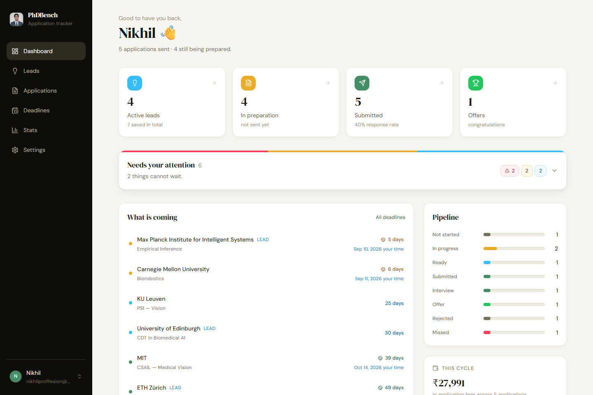

### Applications
*Every application with its stage, readiness, letters, fee and the deadline in both timezones.*

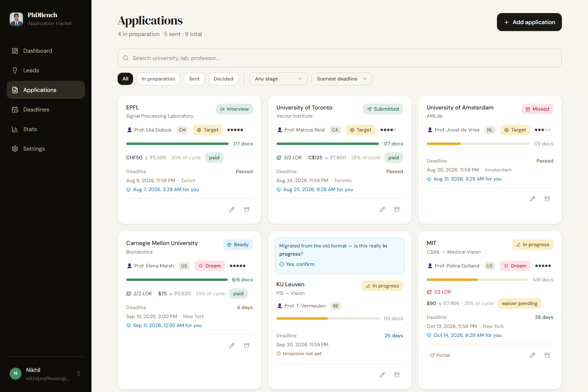

### Application detail
*Stage, deadlines, recommendation letters, documents, and a cold-email composer filled in for this lab.*

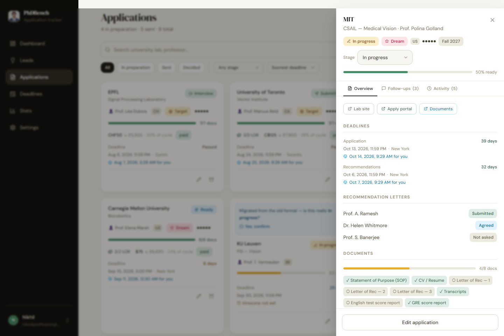

### Deadlines
*Everything with a date, in order, banded by how close it is.*

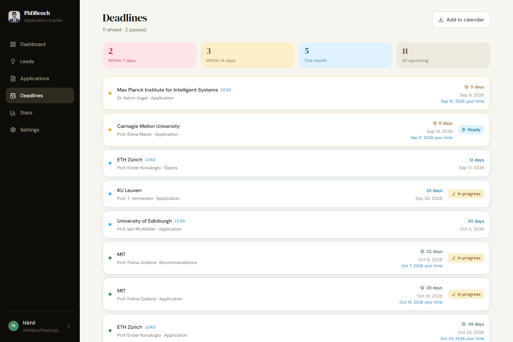

### Leads
*Capture a position in fifteen seconds. Convert it when you decide to apply.*

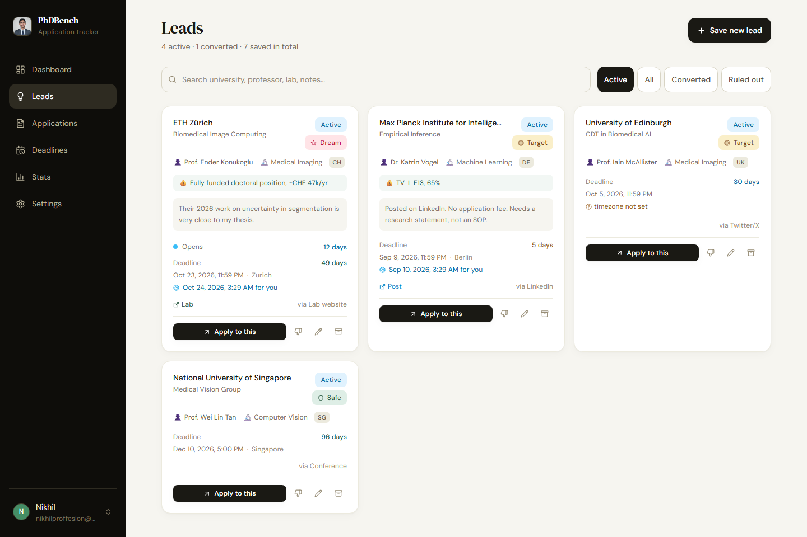

### Stats
*Only genuinely submitted applications count — starting a draft never drags your numbers down.*

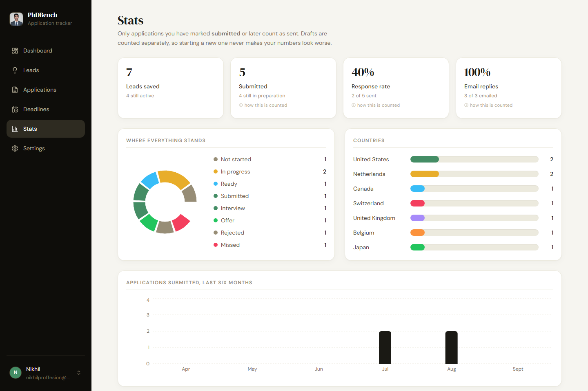

### Settings
*Documents, recommenders, test scores with expiry, credential evaluation, and backup.*

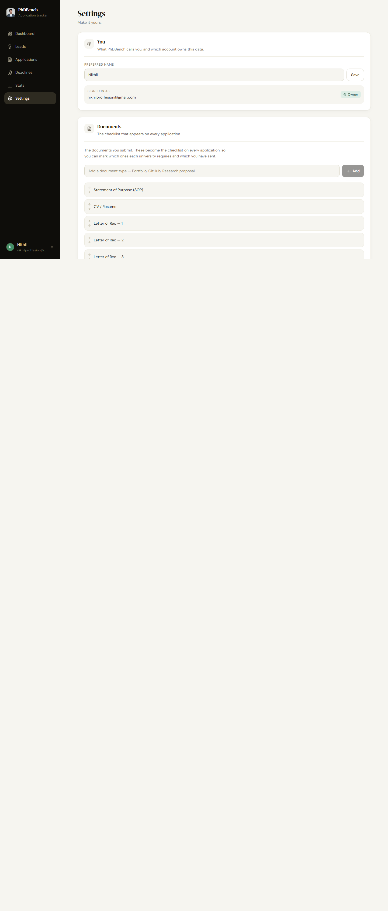

</div>

---

## 📱 Mobile

<div align="center">

*Installable to the home screen, works offline, and navigated by a floating dock rather than a hamburger menu.*

<table>
<tr>
<td align="center" width="20%"><b>Dashboard</b><br/>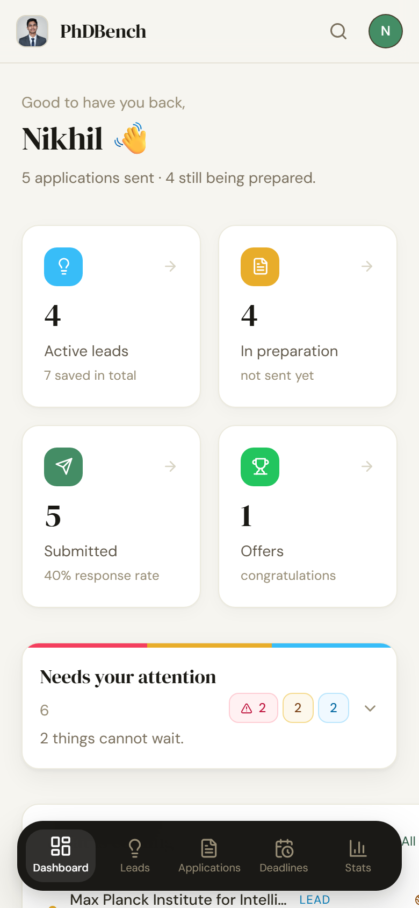</td>
<td align="center" width="20%"><b>Applications</b><br/>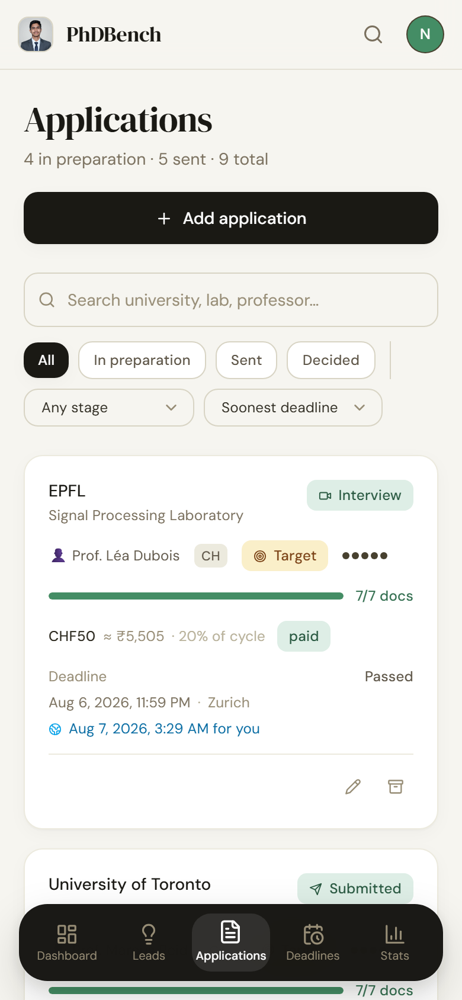</td>
<td align="center" width="20%"><b>Detail</b><br/>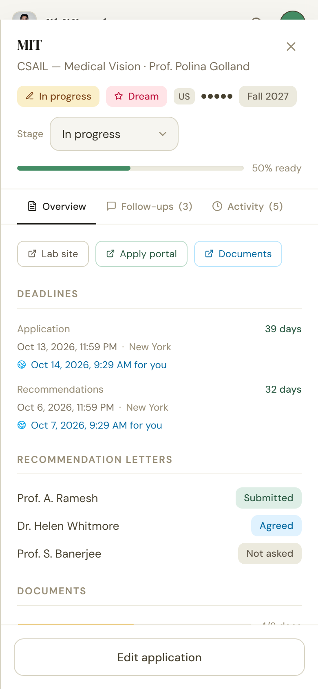</td>
<td align="center" width="20%"><b>Deadlines</b><br/>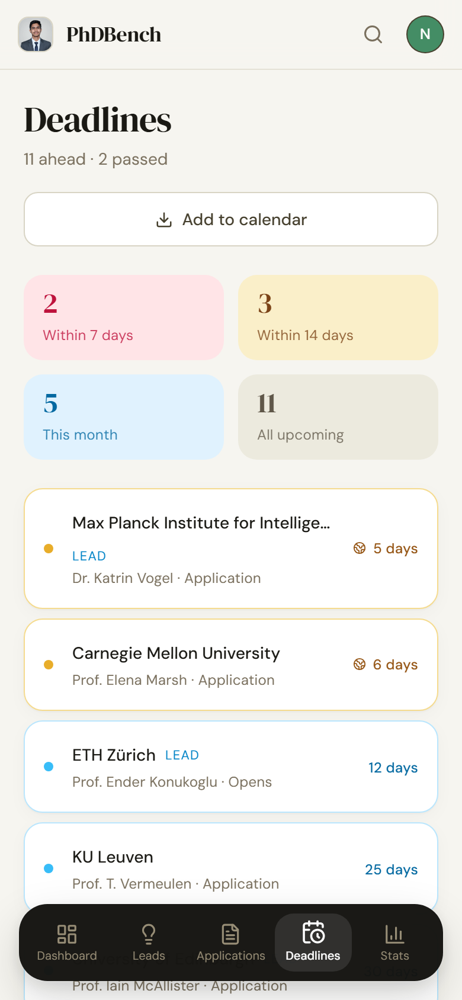</td>
<td align="center" width="20%"><b>Leads</b><br/>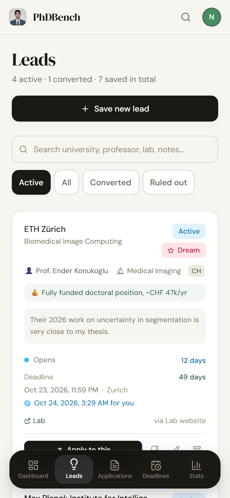</td>
</tr>
</table>

</div>

---

## What it does

**Leads → applications.** Save a position the moment you see it on LinkedIn or a lab page, with as little as a university and a professor. Convert it to a full application when you decide to go for it, and everything carries across.

**A lifecycle that admits you are still working on it.** An application moves through *not started → in progress → ready to send → submitted*, then *under review → interview → offer / waitlist / rejected*, with *withdrawn* and *missed deadline* as honest endings. Emailing a professor is a tracked **action**, not a stage — so you can be in progress *and* have emailed.

**Deadlines that know where the university is.** A deadline is a date, a time, and the university's timezone. A US 11:59 PM cut-off is the next morning in India, and PhDBench says so in as many words rather than leaving you to work it out at 2 AM.

**What is quietly going wrong.** A collapsible panel derives the things that never announce themselves: a recommender you never asked, documents unticked with a week to go, a draft whose deadline has passed, outreach with no reply for three weeks, an English score expiring mid-cycle.

**International specifics.** Country, intake cycle, application fee in its own currency with a running rupee total, fee waivers, WES/ECE credential evaluation, and test-score validity — IELTS and TOEFL lapse at two years, GRE at five, and the app warns you before one dies mid-cycle.

**Nothing is ever lost.** Delete archives; archive restores; every destructive action offers undo. Permanent deletion exists only inside the Archive, behind a hold-to-confirm. A one-click JSON export gives you your own copy on your own disk.

Plus `⌘K` search across everything, `.ics` calendar export so Google Calendar does the reminding, and cold-email templates with merge fields.

---

## Tech

| Layer | Choice |
|---|---|
| UI | React 18 + Vite 6 |
| Styling | Tailwind CSS 3 — light theme only, deliberately |
| Motion | Framer Motion |
| Charts | Recharts |
| Routing | React Router v6 |
| Auth | Firebase Auth (Google, single-owner) |
| Database | Firestore — realtime listeners + persistent offline cache |
| Offline | vite-plugin-pwa / Workbox |
| Tests | Vitest |
| Screenshots | Playwright |
| Hosting | GitHub Pages via Actions |

---

## Running it

```bash
npm install
npm run dev          # http://localhost:5173/phdbench/
```

| Command | What it does |
|---|---|
| `npm test` | Unit tests |
| `npm run build` | Production build |
| `npm run check` | Tests, then build |
| `npm run shoot` | Screenshots every screen at desktop and mobile sizes |

`npm run shoot` builds with `VITE_UI_HARNESS=1`, which swaps auth for a fixture user and Firestore for an in-memory dataset, then photographs all nine screens and **fails on any console error**. The fixture is built to force every state onto the screen — each stage, a deadline crossing the date line, an overdue draft, a lapsed score, an unasked recommender, archived records — so a state that renders wrongly cannot hide. The images above come from it.

---

## Firebase

### ⚠️ Confirm the owner address first

PhDBench is locked to a single Google account. The address appears in **two** places, and they must match each other and the account you actually sign in with:

| File | Constant | Controls |
|---|---|---|
| `src/lib/config.js` | `OWNER_EMAIL` | The UI gate |
| `firestore.rules` | `ownerEmail()` | The real enforcement |

The current value was inferred from this repository's git history (`nikhilproffesion@gmail.com`) — an educated guess, not a verified fact.

Getting `config.js` wrong is a minor inconvenience: you land on a screen naming the address you signed in with and telling you which file to edit. **Getting `firestore.rules` wrong locks you out of your own data at the database layer**, and the only way back is the Firebase console. Check it before publishing.

### Publishing the rules

The rules live in `firestore.rules`, version-controlled — unlike the previous arrangement, where they existed only as a paste block in this README and nobody could tell what was actually deployed.

**Console:** [console.firebase.google.com](https://console.firebase.google.com/) → `phdbench` → Firestore Database → Rules → paste `firestore.rules` → Publish.

**CLI:** `npm i -g firebase-tools && firebase login && firebase deploy --only firestore:rules` (`firebase.json` already points at the file).

The rules allow only the owner's email-verified account, confine it to `/users/{uid}/`, and deny everything outside `/users` outright. Anyone else who signs in is refused at the database layer, not merely hidden in the interface.

### Backups

Firestore's free Spark plan has **no automated backup**. The export in Settings is therefore not a nicety — it is the only thing between you and total loss if the project is deleted, misconfigured, or made unreachable by a rules mistake. The app nags after 30 days.

---

## Data shape

```
users/{uid}/
  profile/main       displayName, recommenders[], testScores[],
                     credentialEvals[], emailTemplates[], lastExportAt
  leads/{id}         university, labName, professor, country, priority,
                     fitScore, startDate, deadline, state, archivedAt
  applications/{id}  everything above, plus stage, submittedAt, decidedAt,
                     intake, applicationType, appUrl, applicationId,
                     deadline / lorDeadline / expectedDecision (date+time+tz),
                     emailed{sentAt,subject,replied}, fee{amount,currency,
                     inrRate,waiver…,paid}, recommenders[], requiredDocs[],
                     submittedDocs{}, driveLink, archivedAt
    followups/{id}   note, date, replied
    activity/{id}    note, system, createdAt
  documents/{id}     name, order
```

Dates are stored as `{ date, time, tz }`. A bare legacy string is read in your local timezone, which places it *earlier* than a Western university's real cut-off — if an unlabelled date has to be wrong, being wrong toward "submit sooner" is the only acceptable direction.

---

<div align="center">

*Personal use. All data private to one Google account.*

</div>
