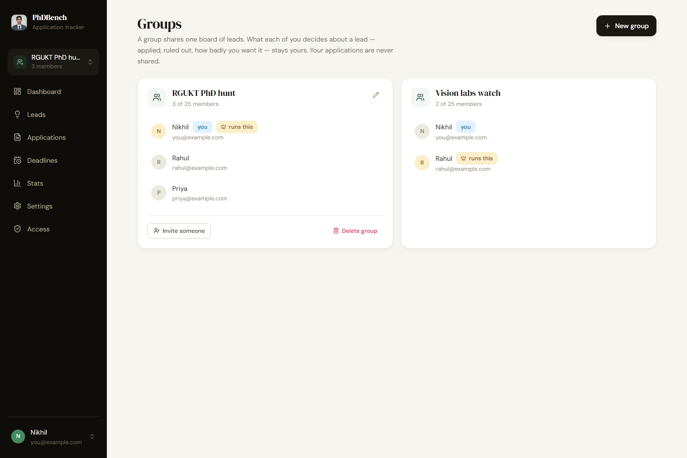
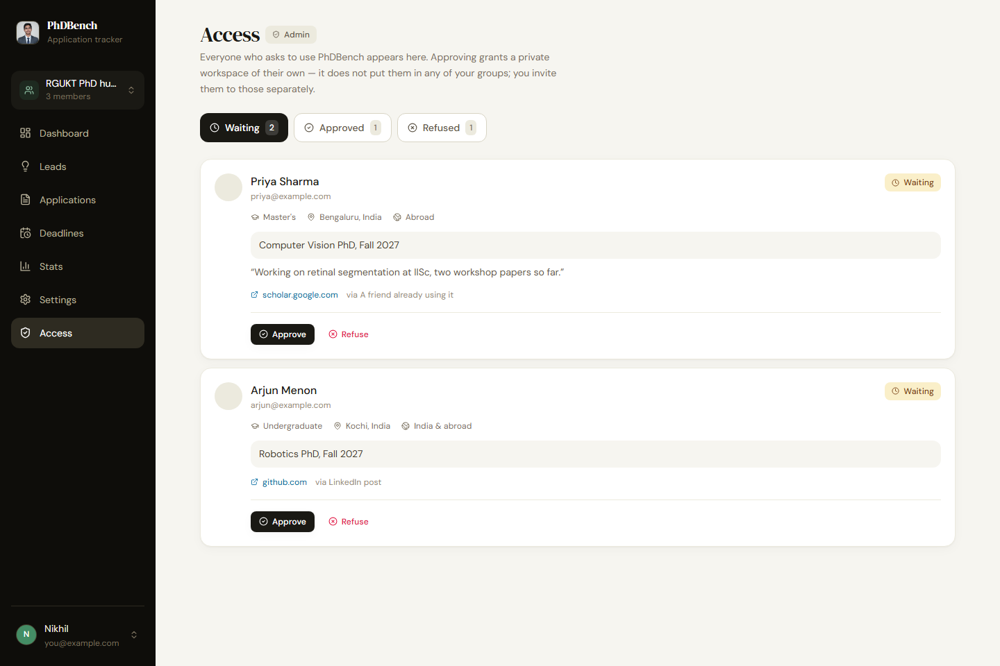
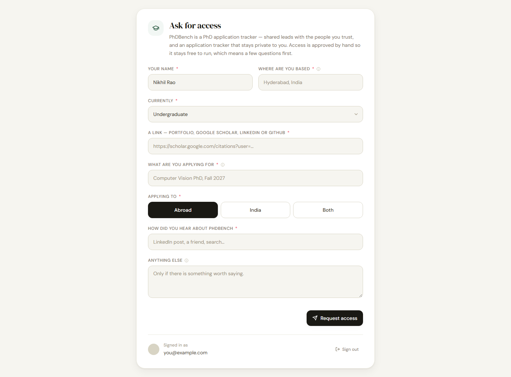

<div align="center">

# PhDBench 🎓

**A PhD application tracker — a shared board of leads with the people you trust,
and an application tracker that stays private to you.**

Built for applying from India to universities worldwide.

[**Open the app →**](https://nikhil-rao20.github.io/phdbench/)

</div>

---

## 🖥️ Desktop

<div align="center">

### Dashboard
*The state of play first. What needs doing sits below it, collapsed, with its counts always visible.*


### Applications
*Every application with its stage, readiness, letters, fee and the deadline in both timezones.*


### Application detail
*Stage, deadlines, recommendation letters, documents, and a cold-email composer filled in for this lab.*


### Deadlines
*Everything with a date, in order, banded by how close it is.*


### Leads
*Capture a position in fifteen seconds. Convert it when you decide to apply.*


### Stats
*Only genuinely submitted applications count — starting a draft never drags your numbers down.*


### Settings
*Documents, recommenders, test scores with expiry, credential evaluation, and backup.*


### Groups
*A shared board per group. Facts are common; what each person decided stays theirs.*



### Access queue — admin only
*Everyone who asks to use PhDBench, with what they told you about themselves.*



### Asking for access
*The front door for anyone who is not approved yet.*



</div>

---

## 📱 Mobile

<div align="center">

*Installable to the home screen, works offline, and navigated by a floating dock rather than a hamburger menu.*

<table>
<tr>
<td align="center" width="20%"><b>Dashboard</b><br/></td>
<td align="center" width="20%"><b>Applications</b><br/></td>
<td align="center" width="20%"><b>Detail</b><br/></td>
<td align="center" width="20%"><b>Deadlines</b><br/></td>
<td align="center" width="20%"><b>Leads</b><br/></td>
</tr>
</table>

</div>

---

## What it does

**Leads → applications.** Save a position the moment you see it on LinkedIn or a lab page, with as little as a university and a professor. Convert it to a full application when you decide to go for it, and everything carries across.

**A lifecycle that admits you are still working on it.** An application moves through *not started → in progress → ready to send → submitted*, then *under review → interview → offer / waitlist / rejected*, with *withdrawn* and *missed deadline* as honest endings. Emailing a professor is a tracked **action**, not a stage — so you can be in progress *and* have emailed.

**Deadlines that know where the university is.** A deadline is a date, a time, and the university's timezone. A US 11:59 PM cut-off is the next morning in India, and PhDBench says so in as many words rather than leaving you to work it out at 2 AM.

**What is quietly going wrong.** A collapsible panel derives the things that never announce themselves: a recommender you never asked, documents unticked with a week to go, a draft whose deadline has passed, outreach with no reply for three weeks, an English score expiring mid-cycle.

**International specifics.** Country, intake cycle, application fee in its own currency with a running rupee total, fee waivers, WES/ECE credential evaluation, and test-score validity — IELTS and TOEFL lapse at two years, GRE at five, and the app warns you before one dies mid-cycle.

**Nothing is ever lost.** Delete archives; archive restores; every destructive action offers undo. Permanent deletion exists only inside the Archive, behind a hold-to-confirm. A one-click JSON export gives you your own copy on your own disk.

Plus `⌘K` search across everything, `.ics` calendar export so Google Calendar does the reminding, and cold-email templates with merge fields.

---

## Tech

| Layer | Choice |
|---|---|
| UI | React 18 + Vite 6 |
| Styling | Tailwind CSS 3 — light theme only, deliberately |
| Motion | Framer Motion |
| Charts | Recharts |
| Routing | React Router v6 |
| Auth | Firebase Auth (Google) + approval queue |
| Database | Firestore — realtime listeners + persistent offline cache |
| Offline | vite-plugin-pwa / Workbox |
| Tests | Vitest |
| Screenshots | Playwright |
| Hosting | GitHub Pages via Actions |

---

## Running it

```bash
npm install
npm run dev          # http://localhost:5173/phdbench/
```

| Command | What it does |
|---|---|
| `npm test` | 114 unit tests |
| `npm run check` | Access-rule parity, tests, then build |
| `npm run shoot` | Screenshots all 15 screens at desktop and mobile sizes |
| `npm run check:modal` | Drives the app in a real browser and checks dialog behaviour |
| `npm run verify` | Everything above, in order |

`npm run shoot` builds with `VITE_UI_HARNESS=1`, which swaps auth for a fixture user and Firestore for an in-memory dataset, then photographs every screen at both sizes. It **fails** on a console error, a leftover loading skeleton, or any horizontal scrolling — naming the element that caused it. Crucially it waits for four separate signals before each shot (content visible, no skeletons, fonts resolved, images complete), because `networkidle` only means requests stopped, and a screenshot taken then is a picture of a half-built page that looks plausible enough to pass review. The images above come from it.

---

## Access and security

Anyone may sign in with Google. Nobody gets in without being approved.

That is deliberate: it keeps the project inside Firebase's free tier while still being open to the public. An unapproved visitor lands on a request form — name, where they are based, what they are studying, a link, what they are applying for, India or abroad, and how they heard about it — which arrives in the admin queue for a one-click decision.

**The administrator is a constant in `firestore.rules`, never data.** Nothing anybody can write inside the app can grant it, so no user can escalate their own access. Everyone else is capped at 500 leads and 500 applications.

### Three data classes

| Path | Who can read it |
|---|---|
| `users/{uid}/…` | That person alone — applications, documents, recommenders, scores |
| `groups/{gid}/leads/…` | The group's members |
| `accessRequests/{uid}` | The requester, and the administrator |

A lead's facts belong to the group; what each person decided about it lives under their own uid inside the same document. Group membership is decided by `memberEmails` alone, in both the rules and the client, so removing somebody actually revokes them.

`scripts/check-access-parity.mjs` fails the build if the rules and the client's copy of that logic drift apart, or if one of 17 security invariants is deleted — including one that asserts the *absence* of a previously-fixed hole.

### Other defences

- **Every user-supplied URL is scheme-checked** before it reaches an `href`. Shared leads mean one member's input renders in another member's authenticated session, so a stored `javascript:` URL would otherwise execute on click. 33 tests cover the bypasses that defeat naive filters — mixed case, embedded tabs and newlines, leading control characters, `data:`, `vbscript:`.
- **Content Security Policy** pins scripts to the app's own bundle and enumerates exactly the endpoints Firebase needs.
- **Frame-buster**, because GitHub Pages cannot set `X-Frame-Options`.

### Deploying

⚠️ **Order matters.** Push the app code first and let Actions deploy it, *then* publish `firestore.rules`. The new rules require an approval record the old code does not create, so publishing first locks you out until the code catches up.

Then add the composite index from `firestore.indexes.json`. Firebase prints a one-click link in the browser console the first time the query runs, which is usually the easiest route.

Firestore's free plan has **no automated backup**. The export in Settings is the only thing between you and total loss; the app nags after 30 days.

---

## Data shape

```
users/{uid}/                 PRIVATE — nobody else, ever
  profile/main       displayName, recommenders[], testScores[],
                     credentialEvals[], emailTemplates[], lastExportAt
  leads/{id}         legacy private leads, kept as a migration fallback
  applications/{id}  everything above, plus stage, submittedAt, decidedAt,
                     intake, applicationType, appUrl, applicationId,
                     deadline / lorDeadline / expectedDecision (date+time+tz),
                     emailed{sentAt,subject,replied}, fee{amount,currency,
                     inrRate,waiver…,paid}, recommenders[], requiredDocs[],
                     submittedDocs{}, driveLink, archivedAt
    followups/{id}   note, date, replied
    activity/{id}    note, system, createdAt
  documents/{id}     name, order

groups/{gid}                 SHARED with the group
  name, createdBy, members{uid: {role,name,email}}, memberEmails[]
  leads/{id}         university, labName, professor, country, deadline,
                     fundingNote, notes, addedBy, addedByName,
                     states{uid: {state, priority, fitScore, archivedAt}}

accessRequests/{uid}         THE APPROVAL QUEUE
  name, email, location, position, link, applyingFor, applyingTo,
  heardFrom, note, status, decidedAt
```

A lead's **facts** are shared; the `states` map holds what each member decided about it. Writing `states.<your uid>` is the only way you change your own view, and it cannot disturb anyone else's — which is what lets one board serve several applicants with different opinions about the same lab.

Dates are stored as `{ date, time, tz }`. A bare legacy string is read in your local timezone, which places it *earlier* than a Western university's real cut-off — if an unlabelled date has to be wrong, being wrong toward "submit sooner" is the only acceptable direction.

---

<div align="center">

*Your applications are yours alone. Your leads are shared only with the people you invite.*

</div>
